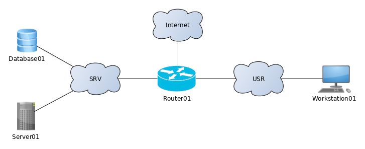
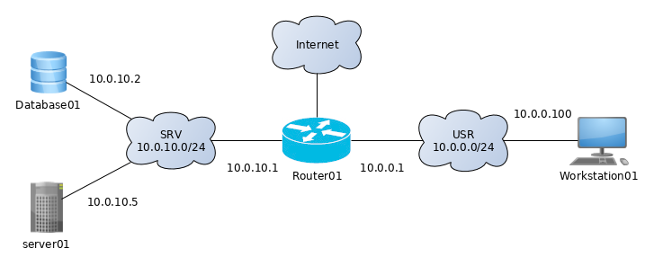

# Layer 3 diagrams

{:toc}

The rules for these diagrams are the same as for all diagrams, i.e. emphasis is on readability. Diagrams are intended to convey information to the reader, so it is fundamental to decide what is to be conveyed.

Layer 3 refers to the thrid layer of the OSI model - the network layer.

##  Common icons
There are certain default icons to use, but for most devices, there are no “standard” icon.  

| Icon - nice | Icon - simple | Name | Comment
| :--- | :--- | :--- | :--- |
| ![][ws]  | ![][ws-s]  | Workstation  |User interaction point, almost always cabled.
| ![][lt]  | ![][lt-s]  | Laptop | Mostly the same as a workstation, except it is mostly wireless
| ![][srv] | ![][srv-s] | Server | A network devices offering some service for clients to connect to.
| ![][fw]  | ![][fw-s]  | Firewall | Security device
| ![][rtr] | ![][rtr-s] | Router | L3 device to route between subnets
| ![][cld] | ![][cld-s] | Cloud | A network of unknown or irrelevant content.
| ![][stg] | ![][stg-s]   | Storage | Device for persistent storage, e.g. NAS

[ws]:    media/nw-diagrams/workstation.png
[ws-s]:  media/nw-diagrams/host-simple.png
[lt]:    media/nw-diagrams/laptop.png
[lt-s]:  media/nw-diagrams/host-simple.png
[srv]:   media/nw-diagrams/server.png
[srv-s]: media/nw-diagrams/host-simple.png
[fw]:    media/nw-diagrams/firewall.png
[fw-s]:  media/nw-diagrams/firewall-simple.png
[rtr]:   media/nw-diagrams/router.png
[rtr-s]: media/nw-diagrams/router-simple.png
[cld]:   media/nw-diagrams/cloud.png
[cld-s]: media/nw-diagrams/cloud-simple.png
[stg]:   media/nw-diagrams/storage.png
[stg-s]: media/nw-diagrams/storage-simple.png

You should go for the icon that your drawing program provides, as long as they resemble the “nice” ones. For drawing by hand, use the “simple” ones.

# Diagrams

Layer 3 diagrams are about subnets, routing and the IP spaces. These are used when explaining a network to

* designers of the network as part of the analysis and design phase, before deciding on specific equipment
* application developers, who should be spared the details of how the network is cabled
* external people who are not to know the internal details of e.g. a company network
* others, where the functionality of the network is the focus as opposed to the specific inner workings.

*Illustration 1: L3 diagram with subnets*

Illustration 1 is an example of a L3 diagram. It signals that e.g. Database01, Server01 and Router01 are all on the subnet called SRV.

Context is important here, and it must be known if SRV is a simple subnet where all connected devices must have compatible IP addresses, or if it has a network structure like the Internet.

*Illustration 2: L3 diagram with subnets and IP addresses*

Illustration 2 continues the example, this time by adding IP addresses and IP address scope to the subnets. It shows the SRV subnet has an the address space of 10.0.10.0/24. Use CIDR notation.

This diagram is very common. It is highly useful in combination with the ping command for debugging.

#  Notable exceptions
Use a cloud whenever some network connectivities are present, but their details are not relevant. This would be the case if the Internet were connected to the network.

It is often relevant to include interface names (like eth0, em0, ge-0/0/0 and such) to the L3 diagram along with the IP address. This is in principle violating the layer 3 idea, but it is information you want when you debug, since the IP addresses are associated with the interface name.

For virtual environments, it could be relevant to include the name of private netowrk used internally by the hypervisor, e.g. SRV is vmnet1. This is written in the “cloud” also.
